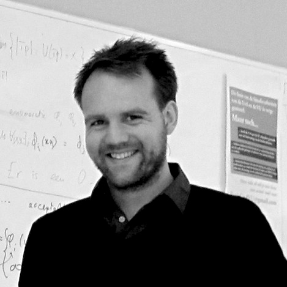

		
# Peter Bloem
		

<ul class="homepage links">
<li><a href="https://github.com/pbloem">github</a></li>
<li><a rel="me" href="https://sigmoid.social/@pbloem">mastodon</a></li>
<li><a href="/bluesky">bluesky</a></li>
<li><a href="https://scholar.google.nl/citations?user=zVntAfQAAAAJ&hl=en">scholar</a></li>
</ul>
<a href="http://orcid.org/0000-0002-0189-5817" class="orcid">orcid.org/0000-0002-0189-5817</a>

I'm an assistant professor at the [Learning & Reasoning Group](https://lr.cs.vu.nl/) at the Vrije Universiteit Amsterdam. I specialize in 
the combination of Machine Learning and Knowledge Representation.

Get in touch  at <a href="mailto:site@peterbloem.nl">p@peterbloem.nl</a>.

